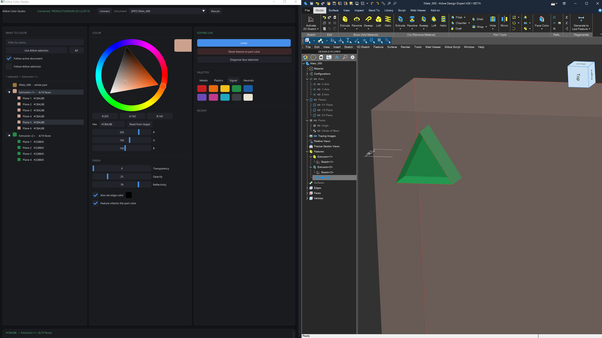

# Alibre Color Studio Experiment 



Color parts, features and assembly components in a running Alibre Design
session, from a DearPyGui window.

```bash
.venv/Scripts/python.exe run_color_studio.py
```

Start Alibre first and open a part or assembly. The app connects on
launch and follows whichever document sits in front.

## Using it

Pick the part, a feature, or a face from the tree on the left, then change the
color. The app writes each edit straight to Alibre at up to eight writes a
second, which is as fast as COM keeps up. Undo steps back one edit.

Tick **Follow Alibre selection** and the tree tracks whatever you click in
Alibre's own window.

## What Alibre lets you color

| Surface | Properties | Settable |
|---|---|---|
| `IADPartSession` | `Color`, `EdgeColor`, `Transparency`, `Reflectivity` | yes |
| `IADPartFeature` | `FaceColor`, `EdgeColor`, `Opacity`, `Reflectivity`, `UsePartColor` | yes |
| `IADOccurrence` | `Color`, `Transparency`, `Reflectivity` | yes |
| `IADFace` | `Color`, `AppearanceID` | **no, get-only** |


## Requirements

- Windows, with Alibre Design V29 or newer installed and running
- Python 3.9 to 3.13 (3.14 works in practice)

## Packages used

| Package | Version | License | Used for |
|---|---|---|---|
| [alibrex](https://pypi.org/project/alibrex/) | 1.0.0 | MIT | Typed Python bindings for the AlibreX API |
| [dearpygui](https://pypi.org/project/dearpygui/) | 2.3.1 | MIT | The GUI toolkit |
| [pythonnet](https://pypi.org/project/pythonnet/) | 3.1.0 | MIT | The .NET and COM bridge that alibrex builds on |
| [pyinstaller](https://pypi.org/project/pyinstaller/) | 6.22.2 | GPL-2.0 with bootloader exception | Optional, for building a standalone `.exe` |

```bash
pip install alibrex dearpygui
pip install pyinstaller        # only to build an .exe
```

Those four pull in `clr_loader`, `cffi` and `pycparser` through pythonnet, and
`altgraph`, `pefile`, `pywin32-ctypes`, `packaging`, `setuptools` and
`pyinstaller-hooks-contrib` through PyInstaller.

The app ships nothing else. Everything remaining comes from the standard
library: `ctypes` drives per-monitor DPI awareness, alongside `dataclasses`,
`os`, `sys`, `time` and `typing`. Windows supplies the UI font.

## Credits

**Alibre Design and the AlibreX API** come from [Alibre, LLC](https://www.alibre.com/).
API documentation lives at [alibre.com/api](https://www.alibre.com/api/).

**alibrex** wraps AlibreX for Python, from the Alibre Design Community Projects
team. Source at
[github.com/AlibreDesignCommunityProjects/alibrex_package](https://github.com/AlibreDesignCommunityProjects/alibrex_package),
package at [pypi.org/project/alibrex](https://pypi.org/project/alibrex/).

**Dear PyGui** draws the interface,
[github.com/hoffstadt/DearPyGui](https://github.com/hoffstadt/DearPyGui). 

**Python.NET** bridges Python and .NET, from the pythonnet contributors.


## Building an .exe

```bash
.venv/Scripts/pyinstaller.exe alibre_color_studio.spec
```

The build lands in `dist/AlibreColorStudio/` and still needs Alibre Design
installed and running.

## High-DPI

The app claims per-monitor DPI awareness, reads the monitor scale factor, then
scales every dimension and bakes the UI font at that pixel size. Text stays
sharp at 150%, 200% and 250%. Force a scale to test one you lack hardware for:

```bash
ALIBRE_COLOR_UI_SCALE=2.0 .venv/Scripts/python.exe run_color_studio.py
```

## Layout

| File | Role |
|---|---|
| `colors.py` | Color packing and palettes. Imports neither Alibre nor the GUI. |
| `backend.py` | Documents, targets, read and apply, undo, selection. No GUI imports. |
| `dpi.py` | Per-monitor DPI awareness and scaling. |
| `theme.py` | The dark theme. |
| `app.py` | DearPyGui widgets and wiring. |

## License

MIT for this application. Each package above carries its own license.